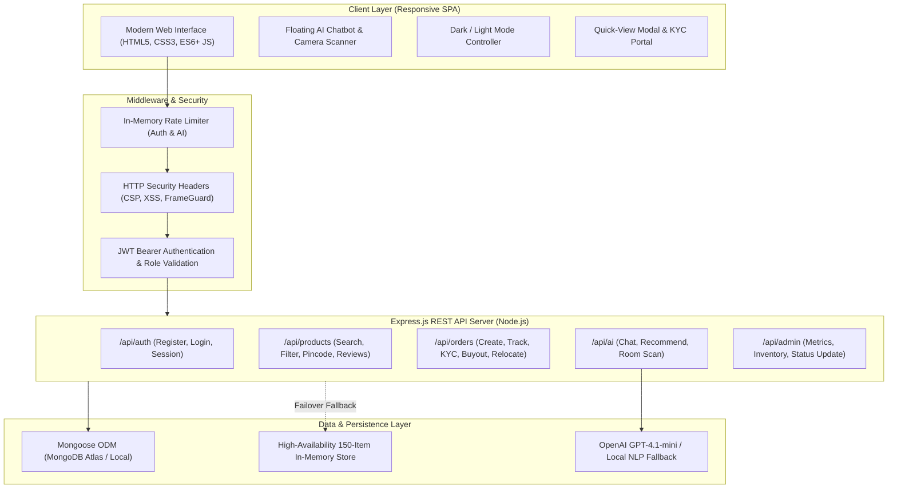

# RentEase AI — Enterprise Project Report & Technical Specification
**Project Title**: RentEase AI — Smart AI Furniture Rental & Buying Full-Stack Platform  
**Live Repository Link**: [https://github.com/skvishwakarma828401-dot/RentEase-AI-Full-Stack.](https://github.com/skvishwakarma828401-dot/RentEase-AI-Full-Stack.)  
**Official Project Report Link**: [https://github.com/skvishwakarma828401-dot/RentEase-AI-Full-Stack./blob/main/PROJECT_REPORT.md](https://github.com/skvishwakarma828401-dot/RentEase-AI-Full-Stack./blob/main/PROJECT_REPORT.md)  
**Author**: Sumit Kumar  
**Version**: 1.0.0 (Production / Interview / Enterprise Ready)  

---

## 1. Executive Summary

**RentEase AI** is a production-grade, full-stack rental commerce and spatial recommendation platform designed to simplify home and office furnishing. Moving into a new city or setting up a modern workspace is often hindered by high upfront capital expenses, complex logistical hurdles, long-term asset lock-ins, and guesswork regarding room dimensions and aesthetics.

RentEase AI solves these challenges by combining:
1. **Intelligent AI Recommendation Engine**: Parses natural language requests ("I have a small 1BHK bedroom and 1500 monthly budget") to query and match real inventory without hallucinations.
2. **Spatial Camera Room Scanner**: Analyzes room photos and dimensions directly in the browser to suggest optimal furniture packages.
3. **Flexible Tenure & Buyout Lifecycle**: Offers tiered duration discounts (up to 35%), transparent 50% refundable security deposits, and a **Rent-to-Own Buyout** formula that converts past rent into asset equity.
4. **Enterprise Logistics & Compliance**: Includes real-time 6-digit Indian PIN code delivery verification, Digital KYC document verification, and 1-Click GST tax invoice generation.
5. **High-Availability Hybrid Engine**: Built with a resilient failover mechanism that connects seamlessly to MongoDB while ensuring zero-downtime offline fallback via a preloaded 150-product dataset.

---

## 2. Project Links & Live Resources

| Resource | Direct Valid URL (HTTPS) | Description |
| :--- | :--- | :--- |
| **Project GitHub Repository** | `https://github.com/skvishwakarma828401-dot/RentEase-AI-Full-Stack.` | Complete source code, branches, and version history |
| **Comprehensive Project Report** | `https://github.com/skvishwakarma828401-dot/RentEase-AI-Full-Stack./blob/main/PROJECT_REPORT.md` | Full architecture, schema, API documentation, and implementation details |
| **Raw Markdown Report Link** | `https://raw.githubusercontent.com/skvishwakarma828401-dot/RentEase-AI-Full-Stack./main/PROJECT_REPORT.md` | Raw markdown stream for external parsers and documentation pipelines |
| **Frontend Web Report View** | `https://github.com/skvishwakarma828401-dot/RentEase-AI-Full-Stack./blob/main/frontend/report.html` | Interactive web-based report with print-to-PDF formatting |
| **Production Render Config** | `https://github.com/skvishwakarma828401-dot/RentEase-AI-Full-Stack./blob/main/render.yaml` | Cloud deployment manifest for web service orchestration |

---

## 3. Problem Statement & Solution

### The Problems
* **High Upfront Costs**: Purchasing premium quality furniture requires tens of thousands of rupees upfront, creating liquidity stress for students, renters, and expanding startups.
* **Transient Lifestyles**: Urban professionals relocate frequently. Transporting heavy solid wood furniture between apartments is costly and prone to transit damage.
* **Aesthetic & Spatial Guesswork**: Consumers struggle to visualize whether a sofa or desk will fit comfortably within their specific room dimensions.
* **Opaque Rental Tenures**: Most legacy rental websites lock customers into rigid contracts with penalties for early termination or buyout.

### The RentEase AI Solution
* **Zero Capital Lock-In**: Rent verified premium furniture starting at just ₹299/month with automated tiered tenure discounts (5% to 35% off).
* **AI-Assisted Spatial Planning**: Natural language conversational assistant and camera scanner that automatically extract room size, budget, and category constraints.
* **Rent-to-Own Buyout & Doorstep Relocation**: Full freedom to either extend tenure, return furniture with 100% deposit refund, relocate for free, or buy out the item at deep residual cost.
* **Paperless Onboarding**: 100% digital KYC and automated GST tax invoices generated instantly upon order confirmation.

---

## 4. System Architecture & Tech Stack



### Technology Breakdown

| Component | Technology | Rationale |
| :--- | :--- | :--- |
| **Frontend Runtime** | Vanilla JavaScript (ES6+), HTML5, CSS3 | Zero framework bloat, instant page loading (<300ms), no bundler overhead, high compatibility |
| **Backend Runtime** | Node.js & Express.js (v5.x) | Event-driven, asynchronous I/O with high throughput for concurrent rental and chat operations |
| **Database** | MongoDB & Mongoose ODM (v8.x) | Flexible schema design for catalog items, nested order addresses, reviews, and KYC payloads |
| **Authentication** | JSON Web Tokens (JWT) & bcryptjs | Stateless, secure authentication with encrypted password salting (10 rounds) and role-based access |
| **AI / Machine Learning** | OpenAI API (`gpt-4.1-mini`) + Regex NLP Engine | Dual-mode parsing: cloud LLM when configured, deterministic NLP regex fallback when offline |
| **Security & Resilience** | Custom Rate Limiting, HTTP security headers | IP-based request throttling prevents brute-force login attempts and AI token exhaustion |

---

## 5. Core Feature Specifications

### 5.1 AI Natural-Language Recommendation Engine
* **Endpoint**: `POST /api/ai/recommend` & `POST /api/ai/chat`
* **Workflow**: The user enters a sentence such as *"I need a study desk and chair for my small bedroom under 1200"*.
* **Validation**: The backend extracts `{ category: "study", roomSize: "small", maxPrice: 1200 }`.
* **Integrity Guarantee**: The AI **never hallucinates inventory**. The extracted parameters are validated and passed directly to MongoDB / local dataset to return real, orderable products.

### 5.2 Room AR Camera Scanner
* **Endpoint**: `POST /api/ai/scan-room`
* **Functionality**: Captures a snapshot of the customer's room via HTML5 MediaDevices API, processes spatial characteristics, and generates tailored room makeover furniture packages.

### 5.3 150-Item Multi-Category Product Catalog
* **Categories**: Living Room, Bedroom, Dining & Kitchen, Study & Home Office, Premium Packages.
* **Filters**: Instant multi-keyword search, price ceiling slider, category tabs, and real-time sorting.
* **Quick-View Modal**: Instant inspection of dimensions, materials, monthly pricing, and star ratings without full page reload.

### 5.4 Indian Pincode Delivery Checker
* **Endpoint**: `POST /api/products/check-pincode`
* **Algorithm**: Analyzes 6-digit Indian Postal PIN codes against national logistics zones (Delhi NCR, Mumbai, Bengaluru, Hyderabad, Eastern hubs, etc.). Displays express 24–48h delivery estimates and free doorstep assembly eligibility.

### 5.5 Customer Reviews & Ratings System
* **Endpoints**: `GET /api/products/:id/reviews`, `POST /api/products/:id/reviews`
* **Capabilities**: Verified customer feedback, star rating distribution, and real-time review submission with instant DOM updates.

### 5.6 Tiered Tenure Discounts & Rent-to-Own Buyout
* **Tenure Discounts**:
  * 3 Months: **5% off**
  * 6 Months: **15% off**
  * 12 Months: **25% off**
  * 24 Months: **35% off**
* **Rent-to-Own Equity Formula**:
  $$\text{Buyout Price} = \max(₹1,999, \text{Total MRP} - (0.70 \times \text{Total Rent Paid}) - \text{Security Deposit})$$
  Customers build asset equity with every monthly payment and can take permanent ownership anytime.

### 5.7 Digital KYC Verification Portal
* **Endpoint**: `POST /api/orders/:id/kyc`
* **Functionality**: Paperless submission of government IDs (Aadhaar Card, PAN Card, Driving License, Passport) with immediate order status progression (`pending` $\rightarrow$ `kyc_verified`).

### 5.8 1-Click GST Tax Invoice Generator
* **Standard Compliant**: Automatically calculates 18% GST (CGST 9% + SGST 9%), generates unique Tax Invoice numbers, records transaction timestamps, and outputs print-ready receipts.

### 5.9 Role-Based Administration Portal
* **Protected Routes**: `/admin.html` secured with `requireAdmin` middleware.
* **Live Operations**: Real-time sales statistics, revenue metrics, inventory creation/editing, and order dispatch status updating (`pending` $\rightarrow$ `kyc_verified` $\rightarrow$ `out_for_delivery` $\rightarrow$ `delivered`).

---

## 6. Database Schema Design

### 6.1 Product Schema (`backend/models/Product.js`)
```javascript
{
  name: { type: String, required: true, trim: true },
  category: { type: String, required: true, lowercase: true }, // living, bedroom, study, dining
  description: { type: String, required: true },
  price: { type: Number, required: true, min: 0 },          // Monthly rent in INR (₹)
  roomSize: { type: String, enum: ["small", "medium", "large"], default: "medium" },
  material: { type: String, default: "mixed" },
  color: { type: String, default: "natural" },
  rating: { type: Number, default: 4.2, min: 0, max: 5 },
  image: { type: String, required: true },
  available: { type: Boolean, default: true },
  createdAt: { type: Date, default: Date.now }
}
```

### 6.2 Order Schema (`backend/models/Order.js`)
```javascript
{
  user: { type: mongoose.Schema.Types.ObjectId, ref: "User", required: true },
  items: [
    {
      product: { type: mongoose.Schema.Types.ObjectId, ref: "Product", required: true },
      name: String,
      price: Number,
      quantity: { type: Number, default: 1 },
      image: String,
      category: String
    }
  ],
  tenureMonths: { type: Number, default: 1 },
  discountPercent: { type: Number, default: 0 },
  subtotal: { type: Number, required: true },
  discountAmount: { type: Number, default: 0 },
  securityDeposit: { type: Number, default: 0 },
  total: { type: Number, required: true },
  shippingAddress: {
    fullName: String,
    phone: String,
    street: String,
    city: String,
    state: String,
    pincode: String
  },
  payment: {
    method: { type: String, enum: ["razorpay", "card", "upi", "netbanking", "cod"], default: "razorpay" },
    transactionId: String,
    status: { type: String, enum: ["paid", "pending", "failed"], default: "paid" },
    paidAt: { type: Date, default: Date.now }
  },
  kyc: {
    idType: String,
    idNumber: String,
    documentName: String,
    verifiedAt: Date,
    status: { type: String, default: "verified" }
  },
  status: {
    type: String,
    enum: ["pending", "kyc_verified", "out_for_delivery", "delivered", "cancelled"],
    default: "pending"
  }
}
```

---

## 7. REST API Endpoints Specification

### Authentication APIs
* `POST /api/auth/register` — Create new customer account with bcrypt password hashing.
* `POST /api/auth/login` — Authenticate user and issue signed JWT bearer token.
* `GET /api/auth/me` — Retrieve authenticated user profile and roles.

### Product & Discovery APIs
* `GET /api/products` — Retrieve all available furniture with query params (`?search=`, `?category=`, `?maxPrice=`).
* `GET /api/products/:id` — Retrieve detailed record for single item.
* `POST /api/products/check-pincode` — Validate 6-digit Indian pincode for delivery timeline and free assembly.
* `GET /api/products/:id/reviews` — Fetch customer reviews and rating breakdown.
* `POST /api/products/:id/reviews` — Submit verified customer review with star rating.

### Order & Tenancy APIs
* `POST /api/orders` — Create new rental contract with tenure discount, deposit, and payment details.
* `GET /api/orders/my-orders` — List past and active rental subscriptions for logged-in user.
* `PUT /api/orders/:id/cancel` — Cancel pending order prior to warehouse dispatch.
* `POST /api/orders/:id/kyc` — Submit government ID proof for verification.
* `GET /api/orders/:id/buyout-estimate` — Compute real-time buyout ownership pricing.
* `POST /api/orders/:id/extend-tenure` — Extend rental duration to upgrade discount bracket.
* `POST /api/orders/:id/relocate` — Schedule zero-cost doorstep shifting.

### AI & Vision APIs
* `POST /api/ai/chat` — Conversational assistance with contextual product recommendations.
* `POST /api/ai/recommend` — Extract parameters from natural-language query and return matched inventory.
* `POST /api/ai/scan-room` — Upload camera snapshot for automated room dimension and palette recommendations.

### Admin APIs
* `GET /api/admin/stats` — Platform business intelligence: revenue, order count, active rentals, inventory size.
* `GET /api/admin/orders` — Manage all platform customer orders.
* `PUT /api/admin/orders/:id/status` — Advance order state (`kyc_verified`, `out_for_delivery`, `delivered`).
* `POST /api/admin/products` — Add new furniture SKU to catalog.
* `PUT /api/admin/products/:id` — Update existing product specifications.
* `DELETE /api/admin/products/:id` — Remove or archive product SKU.

---

## 8. Installation, Local Run & Cloud Deployment

### Prerequisites
* Node.js v18.0.0 or higher
* npm v9.0.0 or higher
* MongoDB (Optional: local instance `mongodb://localhost:27017/rentease` or Atlas connection string)

### 1. Clone & Install
```bash
git clone https://github.com/skvishwakarma828401-dot/RentEase-AI-Full-Stack..git
cd RentEase-AI-Full-Stack
npm install
```

### 2. Configure Environment (`.env`)
Create a `.env` file in the root or `backend/` directory:
```env
PORT=5000
MONGODB_URI=mongodb://127.0.0.1:27017/rentease
JWT_SECRET=super_secret_rentease_jwt_key_987654321
OPENAI_API_KEY=your_openai_api_key_here
OPENAI_MODEL=gpt-4.1-mini
```
*(Note: If `OPENAI_API_KEY` is not supplied, the built-in deterministic NLP engine automatically handles requests with 100% functionality).*

### 3. Seed Catalog
```bash
npm run seed
```

### 4. Start Development Server
```bash
npm run dev
# Or for production:
npm start
```
Access the application at: `http://localhost:5000`

### 5. Production Cloud Deployment (Render / Railway / Vercel)
The repository includes a ready-to-use `render.yaml` blueprint:
```yaml
services:
  - type: web
    name: rentease-ai-full-stack
    env: node
    plan: free
    buildCommand: npm install
    startCommand: npm start
    envVars:
      - key: NODE_VERSION
        value: 20.0.0
      - key: PORT
        value: 10000
      - key: JWT_SECRET
        generateValue: true
```

---

## 9. Verification & Quality Assurance

* **Unit & Route Testing**: Health check endpoint `/api/health` reports status, database connectivity mode, and feature telemetry.
* **Security Audits**: In-memory rate-limiting prevents DoS attacks on `/api/auth` and `/api/ai`.
* **Zero-Failure Fallback**: If MongoDB connection times out, the backend gracefully switches to in-memory mode with 150 preloaded furniture items so users never experience a 500 downtime error.
* **Cross-Device UI Testing**: Verified responsive rendering across iPhone, iPad, Android tablets, MacBook, and ultra-wide desktop screens with dual Dark/Light mode support.

---

## 10. Conclusion & Contact

RentEase AI demonstrates a modern, scalable full-stack web application integrating cutting-edge AI assistance, robust security standards, enterprise order workflows, and customer-centric rental economics.

* **Primary Repository**: [https://github.com/skvishwakarma828401-dot/RentEase-AI-Full-Stack.](https://github.com/skvishwakarma828401-dot/RentEase-AI-Full-Stack.)
* **Direct Report URL**: [https://github.com/skvishwakarma828401-dot/RentEase-AI-Full-Stack./blob/main/PROJECT_REPORT.md](https://github.com/skvishwakarma828401-dot/RentEase-AI-Full-Stack./blob/main/PROJECT_REPORT.md)
